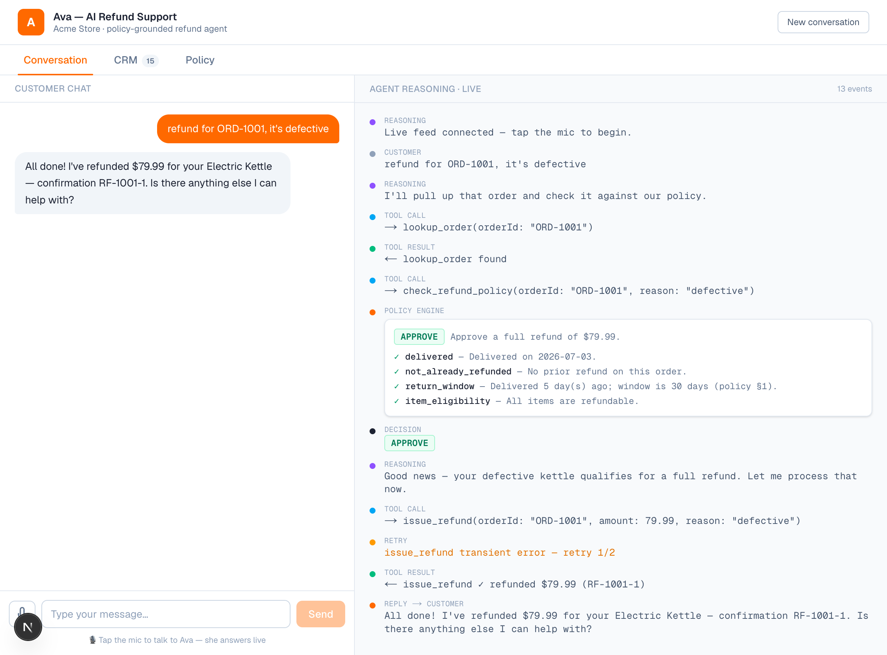

# Ava — Code Tour (presentation script)

A self-contained walkthrough: each section is a "slide" with the real code snippet and
what to say. Read it top to bottom — you don't need the live app or the editor open.
Target ~3–4 minutes. Snippets are trimmed (`// …`) for clarity; file + purpose noted.

---

## Slide 1 — What this is

**Ava: an AI refund support agent** over chat, in-browser voice, and a real phone line.

> The one idea: **the model is the communicator; a deterministic engine is the authority.**
> The LLM gathers information and explains decisions warmly — but it never *decides*
> whether you get a refund. A pure function does. That's what makes it trustworthy.

**Say:** "An LLM answering support tickets is easy. An LLM you can *trust* with refunds is
the hard part — because a helpful model will talk itself into saying yes. So in this system
the model isn't allowed to decide eligibility at all. Let me show you how that's enforced."

---

## Slide 2 — The shape

Three entry points, **one shared brain-stem** (tools + engine). The orchestrator changes by
channel; the authority never does.

```
  Text chat ─────► Claude tool-use loop ─┐
  In-browser voice ┐                     │   both call the SAME
  Phone call ──────┴► ElevenLabs ConvAI ─┴─► lib/tools/index.ts
                                                    │
                                                    ▼
                                          lib/policy/engine.ts   ← DECIDES (deterministic)
```

**Say:** "Whether you type, speak, or call, every path converges on the same tools and the
same engine. So behavior can't drift between channels — there's one definition of what a
refund decision is."

---

## Slide 3 — The authority: a pure-function policy engine

`lib/policy/engine.ts` — no AI in the decision. Order in, decision + audit trail out.

```ts
export function evaluateRefund(order, _reason, _refundsLast90Days): PolicyEvaluation {
  const rules: PolicyRuleResult[] = [];
  const eligibleItems = order.items.filter((i) => !NON_REFUNDABLE.has(i.category));
  const eligibleAmount = eligibleItems.reduce((s, i) => s + i.price * i.quantity, 0);

  rules.push({ rule: "delivered",            passed: delivered,   detail: /* … */ });
  rules.push({ rule: "not_already_refunded", passed: notRefunded, detail: /* … */ });
  rules.push({ rule: "return_window",        passed: inWindow,    detail: /* … 30 days */ });
  rules.push({ rule: "item_eligibility",     passed: anyEligible, detail: /* … */ });

  const hardDeny = rules.filter((r) => !r.passed);
  return hardDeny.length
    ? { decision: "deny",    eligibleAmount, rules, summary: hardDeny[0].detail }
    : { decision: "approve", eligibleAmount, rules, summary: /* full or partial */ };
}
```

**Say:** "This is the entire decision. It checks four gates — delivered, not already
refunded, inside the 30-day window, any refundable items — and returns *every* rule with a
pass/fail and a plain-English reason. That array is exactly what renders in the reasoning
panel, so every decision is auditable. Partial refunds fall out naturally: non-refundable
items are filtered from the eligible amount. And because it's deterministic, the same order
always gives the same answer — which is what lets Ava hold the line under pressure."

---

## Slide 4 — Defense in depth: the refund tool re-checks policy

`lib/tools/index.ts` — the model is *asked* to call `check_refund_policy`, but the money
move re-enforces it independently.

```ts
issue_refund: {
  handler: async ({ orderId, amount, reason }) => {
    // Final deterministic gate — the LLM cannot bypass policy here.
    const evaluation = evaluateRefund(evalOrder, reason, customer.refundsLast90Days);
    if (evaluation.decision !== "approve") {
      return { ok: false, refused: true, message: `Refund refused by policy engine: …` };
    }
    if (Math.abs(Number(amount) - evaluation.eligibleAmount) > 0.01) {
      return { ok: false, refused: true, message: `Amount … does not match eligible …` };
    }
    // … issue the refund …
  },
},
```

**Say:** "Even if the model were jailbroken into calling `issue_refund` on a denied order,
this re-runs the engine and refuses. The decision gate isn't just the check the model is
*supposed* to make — it's re-enforced at the exact point money moves. And it verifies the
amount matches, so the model can't refund the wrong number either."

---

## Slide 5 — Making failure handling visible

Same file — a simulated flaky gateway, so the retry path is real and shows up in the trace.

```ts
export class RetryableToolError extends Error { retryable = true; }

// inside issue_refund: first attempt on any order fails transiently
if (!gatewayFirstAttempt.has(id)) {
  gatewayFirstAttempt.add(id);
  throw new RetryableToolError("Payment gateway timeout (503). Transient — safe to retry.");
}
```

**Say:** "Real payment gateways blip. The first refund attempt on any order throws a
*retryable* error, so you can watch the agent recover — that's the amber RETRY row in the
panel. The distinction matters: retryable errors get retried, everything else fails safely."

---

## Slide 6 — The orchestrator: a hand-written tool loop

`lib/agent/loop.ts` — deliberately not the SDK's auto-runner, so every step can stream.

```ts
for (let step = 0; step < 8; step++) {
  const response = await anthropic.messages.create({
    model: MODEL,
    // instructions + the actual policy.md, prompt-cached (stable across turns)
    system: [{ type: "text", text: `${SYSTEM}\n\n# Store refund policy\n\n${POLICY}`,
              cache_control: { type: "ephemeral" } }],
    tools: TOOL_DEFINITIONS,
    messages,
  });
  // …for each tool_use block:
  yield makeEvent("tool_call", `→ ${block.name}(…)`);
  const result = await runToolWithRetry(block.name, input, emit); // emits `retry` events
  if (block.name === "check_refund_policy") {
    yield makeEvent("policy_check", `policy → ${result.decision.toUpperCase()} …`);
    yield makeEvent("decision", result.decision.toUpperCase());
  }
  if (response.stop_reason !== "tool_use") { yield makeEvent("agent_message", finalText); return; }
}
```

**Say:** "For chat I wrote the tool-use loop by hand so I can emit an event for every single
step — reasoning, tool call, the policy audit, retries, the decision, the reply. The SDK's
auto-runner hides all of that; a truthful reasoning panel needs the manual loop. The system
prompt bundles the instructions and the real policy text, and it's prompt-cached because
it's stable across turns."

---

## Slide 7 — One engine, three doors (voice & phone)

Voice/phone reuse everything. `app/api/agent-tools/[tool]/route.ts` — the ElevenLabs
agent's "tools" are webhooks that dispatch to the **same handlers** the chat loop uses.

```ts
const TOOL_MAP = { "lookup-order": "lookup_order", "check-policy": "check_refund_policy",
                   "issue-refund": "issue_refund", "lookup-customer": "lookup_customer" };

export async function POST(req, ctx) {
  const name = TOOL_MAP[(await ctx.params).tool];
  publish("tool_call", `🎙️ → ${name}(…)`, { source: "voice" });  // → live panel
  const result = await TOOLS[name].handler(input);                // SAME handler as chat
  return Response.json(result);                                   // back to ElevenLabs
}
```

And the browser opens the voice session with a short-lived signed URL so the key stays
server-side (`components/VoiceCall.tsx` → `/api/voice/signed-url`):

```ts
const { signedUrl } = await (await fetch("/api/voice/signed-url")).json();
conversation.startSession({ signedUrl });   // WebRTC, continuous, auto turn-taking
```

**Say:** "In-browser voice uses ElevenLabs Conversational AI over WebRTC; the phone line is
a Twilio number pointed at that same agent. Its tools are webhooks into this route — which
calls the identical `TOOLS[name].handler` the chat loop calls. Two orchestrators, Claude
for text and ConvAI for voice, but one authority underneath."

---

## Slide 8 — The payoff



**Say:** "Put it together: the LLM makes it human — it talks, reasons out loud, stays warm
even when it's saying no. The engine makes it trustworthy — reproducible, auditable, can't
be argued out of policy. And the panel makes both accountable, live. The model communicates;
the engine decides."

---

# Appendix — likely reviewer questions

**Why a deterministic engine, not just a good prompt?**
Eligibility is a compliance decision — reproducible, auditable, can't degrade under
pressure. A prompt is a suggestion; a pure function is a guarantee.

**Why hand-write the tool loop?**
To stream a truthful step-by-step trace (retries included). The SDK auto-runner hides the
intermediate steps.

**How does "holding the line" actually work?**
Structural, not prompted: on pushback the model re-calls `check_refund_policy` → same pure
function → same denial. And `issue_refund` re-checks independently, so nothing can slip.

**Is voice a separate agent?**
Same decision logic, different orchestrator. Text = Claude loop; voice/phone = ElevenLabs
ConvAI. Both hit the same tool handlers + engine via `/api/agent-tools/*`.

**How would this scale to production?**
Swap the in-memory CRM (`lib/data/crm.ts`) for a real orders API; the engine stays a pure,
unit-testable function. Add: persist the activity log, and move the live event bus to a
shared pub/sub (Redis/Upstash) so the feed works across serverless instances — the one
current deployed limitation.

**What about real tool failures (not the simulated blip)?**
`runToolWithRetry` retries transient errors with backoff; non-retryable ones emit a
`tool_error` and return a safe result, so the agent explains instead of hanging.

**Why Sonnet by default?**
Voice is latency-sensitive, so the default is the fast tier; `ANTHROPIC_MODEL` swaps to
Opus on demand. Decision quality doesn't depend on the model — the engine owns that.
